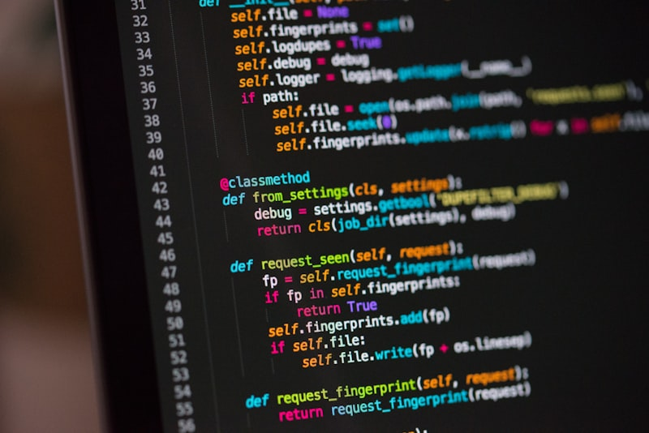

# Week 6 React Native

## Screenshots

- Profile: 
- Upload: 
- MyFiles: 

> Note: placeholder files with the `.MISSING` suffix were added to the `screenshots/` folder. Replace them with real PNG screenshots captured from your device/emulator using the filenames above.

## How to capture screenshots (Android emulator / device)

1. Start Metro: `npm start`
2. Run the app on an Android emulator or connected device.
3. Capture a screenshot with `adb` and save it to the project `screenshots` folder:

```bash
adb exec-out screencap -p > screenshots/profile.png
```

Repeat for the other views and filenames (`upload.png`, `myfiles.png`).

For iOS Simulator (macOS):

```bash
xcrun simctl io booted screenshot screenshots/profile.png
```

After adding the real PNGs, remove the corresponding `.MISSING` placeholder files and commit the images to the repo.
